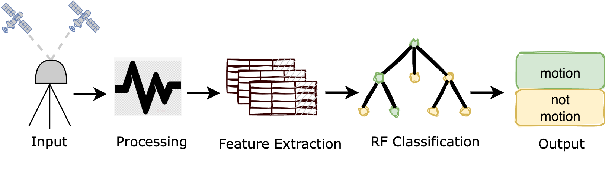

# GNSS Strong Motion Classifier Feature Engineering

## References:
* [TDCP SNIVEL Velocity Processing](https://github.com/crowellbw/SNIVEL)
* [scikit learn](https://github.com/scikit-learn/scikit-learn)

Documenting feature extraction functions used in nested cross validation of a random forest classifier.
Full description in [dittmann et al., 2022](https://www.essoar.org/doi/10.1002/essoar.10511532.1)

